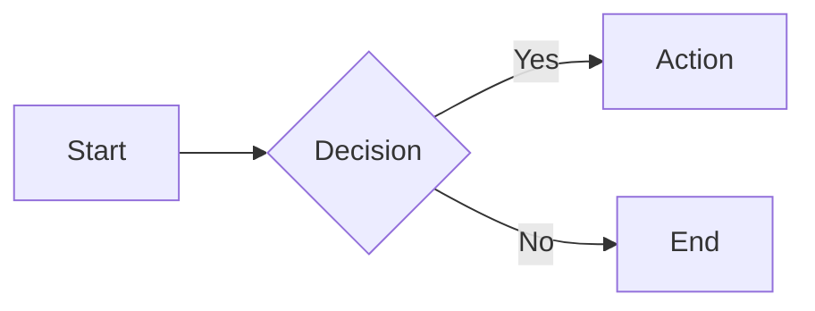

# awesome-md

A read-only Markdown viewer for macOS, purpose-built for AI-powered development workflows.

awesome-md is a lightweight desktop app that renders Markdown files with full support for Mermaid diagrams, Vega-Lite charts, and GitHub Flavored Markdown. It watches the file system for changes and auto-refreshes instantly, making it the ideal companion for tools like Claude Code that generate and update documentation on the fly.

## Features

- **GitHub Flavored Markdown** — tables, task lists, strikethrough, syntax-highlighted code blocks
- **Mermaid diagrams** — flowcharts, sequence diagrams, ER diagrams, and more, rendered inline
- **Vega-Lite charts** — interactive data visualizations from JSON specs in fenced code blocks
- **Live auto-refresh** — file changes are detected via native macOS FSEvents and reflected instantly with scroll position preserved
- **File tree navigation** — recursive sidebar with expand/collapse, auto-updates when files are added or removed
- **Drag-and-drop** — drop a folder onto the window to switch directories without restarting
- **Image support** — renders local (relative path) and remote (HTTP/HTTPS) images
- **Internal link navigation** — click `[link](./other.md)` to navigate between files within the viewer
- **Zoom** — `Cmd+Plus` / `Cmd+Minus` / `Cmd+0` to zoom in, out, or reset
- **Resizable sidebar** — drag the divider to resize, collapse with a button
- **Per-directory persistence** — window position, size, sidebar width, and zoom level are saved per directory
- **Light and dark mode** — follows macOS system appearance automatically
- **Universal binary** — runs natively on both Intel and Apple Silicon Macs

## Installation

### From DMG

Download the latest `.dmg` from [Releases](https://github.com/AriHietamaki/awesome-md/releases), open it, and drag `awesome-md.app` to your Applications folder.

### From source

```bash
git clone https://github.com/AriHietamaki/awesome-md.git
cd awesome-md
npm install
npm start
```

## Usage

### As a desktop app

Launch `awesome-md.app` from Applications. Drop a folder onto the window to start browsing Markdown files.

### From the command line

```bash
# View current directory
awesome-md .

# View a specific directory
awesome-md ~/projects/my-docs

# Custom window title
awesome-md ~/projects/api-docs --title "API Documentation"
```

| Argument | Description | Default |
|---|---|---|
| `[directory]` | Directory to browse | `.` (current directory) |
| `-t, --title <title>` | Window title | Directory name |
| `-V, --version` | Show version | |
| `-h, --help` | Show help | |

### Keyboard shortcuts

| Shortcut | Action |
|---|---|
| `Cmd` + `=` | Zoom in |
| `Cmd` + `-` | Zoom out |
| `Cmd` + `0` | Reset zoom |

## Supported code blocks

### Mermaid

Use a fenced code block with the `mermaid` language tag:

````markdown

````

All Mermaid diagram types are supported: flowcharts, sequence diagrams, class diagrams, state diagrams, ER diagrams, Gantt charts, pie charts, and more. Diagrams automatically adapt to light/dark mode.

### Vega-Lite

Use a fenced code block with the `vega-lite` or `vega` language tag:

````markdown
```vega-lite
{
  "data": { "values": [
    {"category": "A", "value": 28},
    {"category": "B", "value": 55}
  ]},
  "mark": "bar",
  "encoding": {
    "x": {"field": "category", "type": "nominal"},
    "y": {"field": "value", "type": "quantitative"}
  }
}
```
````

Charts render as SVG and automatically size to the container width when no explicit width is set.

## Architecture

awesome-md follows Electron's three-process architecture with strict security boundaries:

```
┌─────────────────────────────────────────────────────┐
│  Main Process (Node.js)                             │
│  ├── CLI argument parsing                           │
│  ├── File system operations (read, scan, watch)     │
│  ├── Window state persistence                       │
│  └── IPC request handlers                           │
├─────────────────────────────────────────────────────┤
│  Preload (contextBridge)                            │
│  └── Typed API surface (window.electronAPI)         │
├─────────────────────────────────────────────────────┤
│  Renderer Process (React)                           │
│  ├── FileTree — sidebar with directory tree         │
│  ├── MarkdownViewer — rendering engine              │
│  │   ├── CodeBlock → MermaidCode / VegaCode         │
│  │   ├── ImageRenderer (local-file:// protocol)     │
│  │   └── LinkRenderer (internal / external)         │
│  ├── DropZone — drag-and-drop folder selection      │
│  └── RefreshIndicator — auto-refresh feedback       │
└─────────────────────────────────────────────────────┘
```

**Security model:**
- `contextIsolation: true` — renderer has no direct Node.js access
- `nodeIntegration: false` — no `require()` in renderer
- Read-only file access — main process validates all paths stay within the target directory and only allows `.md` files
- External links open in the system browser via `shell.openExternal` (HTTP/HTTPS/mailto only)

## Technology stack

| Layer | Technology | Version |
|---|---|---|
| Runtime | Electron | 40 |
| UI | React | 19 |
| Language | TypeScript | 5.9 |
| Bundler | Vite | 5.4 |
| Packaging | Electron Forge | 7.11 |
| Markdown | @uiw/react-markdown-preview | 5.1 |
| Diagrams | Mermaid | 11 |
| Charts | Vega-Lite + Vega | 6.4 + 6.2 |
| File watching | chokidar | 4.0 |
| CLI | commander | 14 |

## Development

### Prerequisites

- Node.js 20+
- npm 10+
- macOS 13 (Ventura) or later

### Scripts

```bash
npm start          # Launch dev environment with hot reload
npm run lint       # Run ESLint
npm run package    # Build .app bundle (host architecture)
npm run make       # Build universal DMG for distribution
```

### Project structure

```
src/
├── main/                    # Main process (Node.js)
│   ├── main.ts              # Window creation, IPC setup
│   ├── cli-args.ts          # --dir / --title parsing
│   ├── directory-scanner.ts # Recursive .md file discovery
│   ├── file-watcher.ts      # chokidar file watching
│   ├── ipc-handlers.ts      # IPC channel handlers
│   └── window-state.ts      # Position/size/zoom persistence
├── preload/
│   └── preload.ts           # contextBridge API
├── renderer/                # React UI
│   ├── App.tsx              # Root layout (sidebar + content)
│   ├── theme.css            # CSS custom properties (light/dark)
│   └── components/
│       ├── Sidebar/         # Collapsible sidebar container
│       ├── FileTree/        # Directory tree with expand/collapse
│       ├── MarkdownViewer/  # Rendering engine
│       ├── DropZone/        # Drag-and-drop folder selection
│       └── RefreshIndicator/
└── shared/
    ├── constants.ts         # IPC channels, default values
    └── types.ts             # Shared interfaces
```

## Building for distribution

```bash
npm run make
```

This produces a universal (x64 + arm64) DMG at `out/make/awesome-md-<version>-universal.dmg`. The app is ad-hoc signed, which is sufficient for local distribution. Apple Developer ID signing is required for public distribution via notarization.

## License

[MIT](LICENSE)
